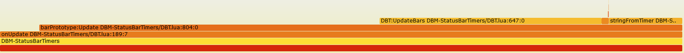

# Validating accuracy

WoW classic still has the builtin profiler (CVar `scriptProfile`), so we can compare Perfy against it to see how good or bad we are.

## Notes on the builtin profiler

We can make an educated guess on how the builtin profiler probably works based on the APIs it offers:
The core reporting mechanic it provides is that it can tell you how much time a given function used (with or without including subroutines) and how often it was called.
The additional functions about reporting per AddOn or per frame are just aggregations built on top of this.

Since it accurately reports how often a function is called it must be based on tracing each call and not on sampling.
My guess is that it hooks into the Lua VM for handling the opcodes `CALL`, `TAILCALL`, and `RETURN` and then stores the elapsed time and a counter in the Lua object representing the function.
`GetFunctionCPUUsage(func, includeSubroutines)` then just returns these fields for the given function.
This is low overhead and easy to implement but does not allow you to reconstruct the entire call stack as it does not remember which function called which.
Fun fact: the reported time per function has the same granularity as `GetTimePreciseSec()` (100 ns), I don't think that is a coincidence.

Overall the builtin profiler is a bit cumbersome to use because you need the actual function object to query the results and it can't tell you anything about the relation between functions.


## Test setup

Since the builtin profiler is a bit annoying to use we need to look at something that involves only a few functions.
Whatever we are testing also needs to be reproducible because we want to run both profilers independently.
Finally, it should also be somewhat realistic.

DBM-StatusBarTimers' update logic for DBM timers fits this description.
It only has 5 relevant functions, presents a realistic workload (5% of total CPU load in the Gnomeregan example from README.md), and it is reproducible by running `/dbm test` which starts a few timers lasting 60 seconds total.


## Test results

[](https://emmericp.github.io/Perfy/perfy-cpu-dbm-test.svg)

The functions we are looking at are the five largest in the flame graph above: `onUpdate`, `barPrototype:Update`, `DBT:UpdateBars`, `stringFromTimer`, and `AnimateEnlarge`.

The run with the builtin profiler was done without Perfy instrumentation in place and `scriptProfile` was disabled when running Perfy.
The total number of calls to all functions was identical for Perfy and the builtin profiler, and stayed identical across all runs.
It always took exactly 18176 calls to the `onUpdate` handler to run the DBM test mode with my game running at a stable 60 fps.

Each run was repeated 5 times, the table shows the average and standard deviation.

| Function              |      Builtin profiler (µs) |             Perfy (µs) | Discrepancy |
|-----------------------|---------------------------:|-----------------------:|------------:|
| `onUpdate`            |              273740 ± 0.5% |          282690 ± 0.3% |       3.3%  |
| `barPrototype:Update` |              260560 ± 0.6% |          265522 ± 0.3% |       1.9%  |
| `DBT:UpdateBars`      |               98564 ± 0.7% |           94413 ± 1.2% |      -4.2%  |
| `stringFromTimer`     |               24465 ± 0.9% |           29985 ± 0.8% |      22.6%  |
| `AnimateEnlarge`      |                2916 ± 1.8% |            2992 ± 1.2% |       2.5%  |

Perfy tends to report a slightly higher CPU usage -- this is expected because even with all the logic to account for overhead it will still at least add the cost of one function call (to `Perfy_GetTime()`) to each function.
Neither Perfy nor the builtin profiler are perfect, I'm happy that these agree to within a few percent :)

Two results are a bit odd an warrant further investigation:


### DBT:UpdateBars() is reports a lower time, everything else reports a higher time

This is because the most commonly executed path in the function is just a tight loop calling some WoW API functions.
Perfy does not add extra overhead to these functions -- but the builtin profiler does.
This can be validated by running Perfy with and without the builtin profiler enabled: it adds 11% overhead to this function.
For other functions such as `stringFromTimer` or `AnimateEnlarge` it only adds 3% and 5% respectively.

This means it's not Perfy that is wrong here but the builtin profiler.
Again, neither of these is perfect.


### stringFromTimer() has a 22% discrepancy

This is a simple leaf function that formats the remaining time into a human-readable format.

```
local function stringFromTimer(t)
	if t <= DBT.Options.TDecimal then
		return ("%.1f"):format(t)
	elseif t <= 60 then
		return ("%d"):format(t)
	else
		return ("%d:%0.2d"):format(t / 60, math.fmod(t, 60))
	end
end
```

The problem here is are the tail calls to `string.format`, the function is instrumented as follows:

```
local function stringFromTimer(t) Perfy_Trace(Perfy_GetTime(), "Enter", "stringFromTimer")
	if t <= DBT.Options.TDecimal then
		return Perfy_Trace_Leave("Leave", "stringFromTimer", ("%.1f"):format(t))
	elseif t <= 60 then
		return Perfy_Trace_Leave("Leave", "stringFromTimer", ("%d"):format(t))
	else
		return Perfy_Trace_Leave("Leave", "stringFromTimer", ("%d:%0.2d"):format(t / 60, math.fmod(t, 60)))
	end
end
```

`Perfy_Trace_Leave` wraps the original return expression and returns it again, that allows us to inject a tracepoint between the evaluation of the return expression and the actual return.
But unlike `Perfy_Trace` at the beginning of the function it can't contain a call to `Perfy_GetTime()` to determine when the return is happening -- this is instead done inside Perfy.
That means the time it takes to call into Perfy is incorrectly attributed to `stringFromTimer` and cannot be subtracted by the analysis script.
`stringFromTimer` has a discrepancy of 5520 µs vs. our reference, it is called 16010 times in the trace, so that's 0.345 µs of error per call.

Unfortunately I don't think this is fixable for the general case:
we would need to add the `Perfy_GetTime()` call to the end of the expression list to make sure it is evaluated after all return expressions, but the last expression can return a vararg of unknown length, so we can't just add it.

I validated this by rewriting all return points in `stringFromTimer` as follows

```
local res = (""):format(t)
Perfy_Trace(Perfy_GetTime(), "Leave", "stringFromTimer")
return res
```

Perfy now reports only 27175 µs of total time (it got faster) for this function and the builtin profiler reports 26588 µs (it got slower) when changing from a tail call to an intermediate variable.
That's a discrepancy of only 2.2% and in line with other functions.

### Conclusion

Overall it's pretty accurate, especially when looking at the big picture.
Note how the error for functions with tail calls is only large when looking at the relative error of a small function.
The absolute error is on the order of hundreds of nanoseconds per function call.
