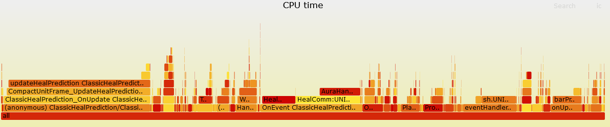
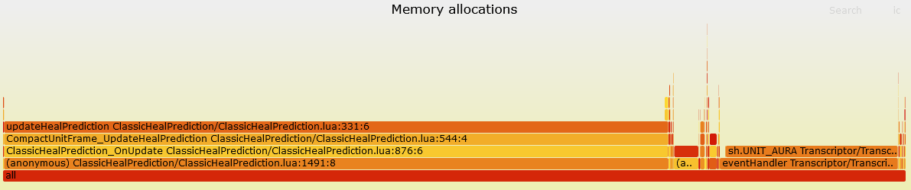

# Instrumentation-based performance profiling for Lua in WoW

Perfy injects code into World of Warcraft AddOns to measure performance, it can tell you exactly where CPU time is spent and which functions allocate how much memory.

# Example: Tracing a boss fight in Gnomeregan

I traced the Mechanical Menagerie fight in Gnomeregan with all AddOns I use instrumented with Perfy.
The trace covers the whole fight (146 seconds) and serves as a simple example for tracking down a performance bottleneck.

## CPU usage

[](https://emmericp.github.io/Perfy/perfy-cpu.svg)
Click on the graph above to open an interactive SVG to fully explore it!

In total Perfy traced 5.6 seconds of execution time, that is an average CPU load of only 3.8% due to 3rd party addons.
So nothing to worry about, but it is a bit odd that 42% of this load is due to ClassicHealPrediction.

## Memory allocations

[](https://emmericp.github.io/Perfy/perfy-memory.svg)
Click on the graph above to open an interactive SVG to fully explore it!

Perfy found a total of 303 MB of memory being allocated during the encounter, that's 120 MB per minute.
73% of that was entirely due to ClassicHealPrediction.

Allocating memory isn't a bad thing per se, the Lua garbage collector is pretty decent.
But it can still lead to micro stuttering so AddOns typically avoid allocating memory, especially during boss fights in big raids.
So there's clearly something going wrong in ClassicHealPrediction because why would it need so much memory in a simple 10 man raid?
I wonder how much worse it is in a 40 man raid, I would love to see a trace!

The function that Perfy identified gets called OnUpdate (i.e., 60 times per second for me) and for every unit frame.
It then re-draws the heal predictions (even if nothing changed) and calls `CreateColor()` up to 8 times to do so.
`CreateColor()` allocates a new `ColorMixin` every time for the same color and that's how we got the excessive allocations.

How did I identify `CreateColor()`, a function that does not show up at all in the Flame Graph above at all?
The reason why it doesn't show up separately is that we cannot instrument functions that belong to the default UI, so identifying the culprit was an educated guess.

I confirmed that this is indeed the culprit by pulling out the color creation into a separate function that wraps `CreateColor()`.
Running the whole process again shows that virtually all of the memory allocation is now in that new wrapper function.
Maybe Perfy can automate this in the future, tracing only at entry and exit points is arbitrary.
We could add an option that adds extra trace points into hot functions.

# Usage

## Install dependencies

* [Lua 5.3](https://lua.org) or newer
* [lua-language-server](https://github.com/LuaLS/lua-language-server)
* [FlameGraph](https://github.com/brendangregg/FlameGraph)

## Instrument 

Run `Instrumentation/Main.lua` under lua-language-server and provide it a list of .toc files as input.
It will automatically find all Lua files referenced there.
**Caution: it modifies files in place, so it's best to make a backup before running this on your AddOns folder.**

```
./bin/lua-language-server <path to perfy>/Instrumentation/Main.lua <path to wow-addons>/*/*.toc
```

You don't have to add it to every AddOn, it's perfectly fine to only instrument the AddOn you are interested in.
But note that shared libraries are only instanced by one AddOn depending on them, so they may be missing from the traces if the used instance is not instrumented.
If uninstrumented AddOns use shared libraries from instrumented AddOns there may be large unexplained self-times of functions if the instrumented shared library is the initial entry point of a call trace (e.g., timers).

## Measure

Install the WoW AddOn in `AddOn/` as `AddOns/Perfy` and start measuring in game as follows:

```
/run Perfy_Start()
/run Perfy_Stop()
```

Reload your UI or log out afterwards to make WoW export the data.

`Perfy_Start(runtime)` also takes an optional parameter for runtime in seconds to stop it automatically.

**Keep measurement times short, this is not something that can run continously.**
Short means a few minutes depending on the load and number of instrumented AddOns.
The main bottleneck is memory, it needs a few hundred MB per minute with my UI during a Gnomeregan boss fight.

## Analyze

Run `Analyzer/Main.lua` on the saved variables export of the AddOn.

```
lua Main.lua <WoW path including classic|retail|era>/WTF/Account/<Account name>/SavedVariables/Perfy.lua
```

If you get an error about the data file being too large: make sure to run Lua version 5.3 or newer.

This outputs two files: `stacks-cpu.txt` with CPU usage in microseconds and `stacks-memory.txt` with memory allocations in bytes.

## Visualize

The files from the previous step are in the folded/collapsed stack format expected by [flamegraph.pl](https://github.com/brendangregg/FlameGraph).

```
./flamegraph.pl stacks-cpu.txt --countname "Microseconds" --title "CPU time" > perfy-cpu.sv
./flamegraph.pl stacks-memory.txt --countname "Bytes" --title "Memory allocations" > perfy-memory.svg
```

The input text files can also be pre-filtered (just use `grep`, the format is pretty self-explanatory) to remove things you are not interested in.

# FAQ

## Your handling of tail calls is wrong!

Yes, I know.
Perfy records leaving a function before return values are evaluated, so if a return value is a function call then that will look like it came from the caller in the trace.
I'll fix that later.

## Why do you sometimes get memory stacks with negative allocation?

Good question, it looks like `collectgarbage("count")` is non-monotonic even when garbage collection is disabled which breaks the assumptions of the trace analyzer.
We should probably handle this a bit more gracefully in the trace.

## What about the default UI/Blizzard AddOns?

Impossible to instrument on the code level due to code signing.
We could hook some functions but that always risks breaking everything due to taint.

## Do the colors in the Flame Graph mean anything?

The color is a hash of the function name, so two entries of the same color are probably the same function called at different points.

## How does it measure CPU time?

The injected code calls `GetTimePreciseSec()` which maps to some high frequency counter, probably in a system-specific manner.
On my system (Windows 11) this has a granularity of 100 ns which is good enough for profiling interpreted code.

## How does it measure memory allocations?

Starting perfy disables garbage collection and the injected code calls `collectgarbage("count")` to measure changes in allocations.

## No fair, you changed the outcome by measuring it!

Measuring performance will always affect performance, this is especially true for profilers based on instrumentation.
Perfy adds around 2µs of overhead (on my Ryzen 7800X3D) and ~400 byte of memory allocations to every function call (two trace entries).
This overhead is accounted for separately and subtracted during analysis, so the overall measurement results are probably still pretty accurate.

## What about dynamically loaded code?

Will be accounted to the function that calls it.

## What about coroutines?

Poorly supported, some time/memory will be missing in the result for functions using coroutines and you will see some warnings when running the analyzer script.

## Why do I get an error about the constant table size in Perfy saved variables when reloading?

Perfy writes out a lot of data and WoW tries to load this again on reloading.
For profiling anything non-trivial it writes out more data than Lua 5.1 can load.
This is also the reason why a newer Lua version is required for the Analysis scripts.

This error can be ignored since we don't want to read back the data anyways.
But unfortunately we can't surpress it.
