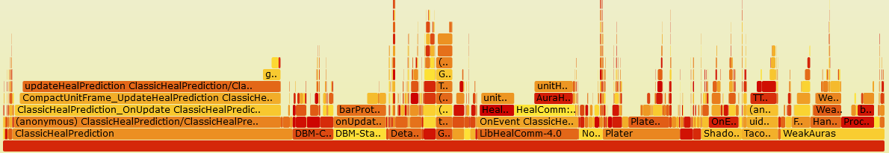
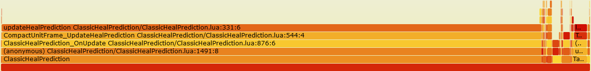

# Instrumentation-based performance profiling for Lua in WoW

Perfy injects code into World of Warcraft AddOns to measure performance, it can tell you exactly where CPU time is spent and which functions allocate how much memory.

# Example: Finding the source of micro stuttering in classic raids

I traced the Mechanical Menagerie fight in Gnomeregan with all AddOns I use instrumented with Perfy.
The trace contains about 5 million entries that span a time of 214 seconds including the whole fight (195 seconds) and is a good example for tracking down a real performance problem.

## CPU usage

[](https://emmericp.github.io/Perfy/perfy-cpu.svg)

This visualization is called a [Flame Graph](https://www.brendangregg.com/flamegraphs.html), a neat way to visualize hierarchical data such as resource usage by call stacks. Click on the graph above to open an interactive SVG to fully explore it!


In total Perfy traced 6.8 seconds of execution time, that is an average CPU load of only 3.2% due to 3rd party addons.
So nothing to worry about, but it is a bit odd that 43% of this load is due to ClassicHealPrediction and LibHealComm.

## Memory allocations

[](https://emmericp.github.io/Perfy/perfy-memory.svg)
Click on the graph above to open an interactive SVG to fully explore it!

Perfy found a total of 489 MB of memory being allocated during the trace, that's 122 MB per minute.
91% of that was due to ClassicHealPrediction.

Now that is an interesting result and probably the cause of our micro stuttering.
Allocating memory isn't a bad thing per se, the Lua garbage collector is pretty decent.
But garbage collection pauses can still lead to micro stuttering, so AddOns typically avoid allocating memory, especially during boss fights in big raids.
There's clearly something going wrong in ClassicHealPrediction because why would it need so much memory in a simple 10 man raid?
There are [reports of it being worse in larger raids](https://github.com/dev7355608/ClassicHealPrediction/issues/2), I wonder how much it needs in a 40 man raid, I would love to see a trace!

The function `updateHealPrediction` that Perfy identified gets called OnUpdate (i.e., 60 times per second for me) and for every unit frame.
It then re-draws the heal predictions (even if nothing changed) and calls `CreateColor()` up to 8 times to do so.
`CreateColor()` allocates a new `ColorMixin` every time for the same color and that's how we got the excessive allocations.

How did I identify `CreateColor()`, a function that does not show up at all in the Flame Graph above at all?
The reason why it doesn't show up separately is that we cannot instrument functions that belong to the default UI, so identifying the culprit was an educated guess.

I confirmed that this is indeed the culprit by pulling out the color creation into a separate function that wraps `CreateColor()`.
Running the whole process again shows that virtually all of the memory allocation is now in that new wrapper function.

# Usage

## Install dependencies

* [Lua 5.3](https://lua.org) or newer
* [lua-language-server](https://github.com/LuaLS/lua-language-server)
* [FlameGraph](https://github.com/brendangregg/FlameGraph)

## Instrument 

Run `Instrumentation/Main.lua` under lua-language-server and provide it a list of .toc files as input.
It will automatically find all Lua files referenced there.
**Caution: it modifies files in place, so it's best to make a backup before running this on your AddOns folder.**

```
./bin/lua-language-server <path to perfy>/Instrumentation/Main.lua <path to wow-addons>/*/*.toc
```

You don't have to add it to every AddOn, it's perfectly fine to only instrument the AddOns you are interested in.
But note that shared libraries are only instanced by one AddOn even if multiple AddOns are trying to load them, so they may be missing from the traces if the used instance is not instrumented.
If uninstrumented AddOns use shared libraries from instrumented AddOns there may be large unexplained self-times of functions in the instrumented shared library if it is the initial entry point of a call trace (e.g., timers).

## Measure

Install the WoW AddOn in `AddOn/` as `AddOns/!!!Perfy` and start measuring in game as follows:

```
/perfy start
/perfy stop
```

Reload your UI or log out afterwards to make WoW export the data.

`/perfy start <time>` also takes an optional parameter for runtime in seconds to stop it automatically.
You can also run just `/perfy` to toggle it.

**Keep measurement times short, this is not something that can run continously.**
Short means a few minutes depending on the load and number of instrumented AddOns.
The main bottleneck is memory, it needs an average of 240 bytes per trace entry (`216 * #entries + 2^ceil(log_2(#entries)) * 24` bytes to be exact) and the whole UI will leak memory/accumulate garbage since tracing disables garbage collection.
With my personal UI setup this adds up to about 100-200 MB per minute during a Gnomeregan boss fight.

Perfy regularly reports how many events it already gathered, as a rule of thumb you shouldn't exceed 10 to 20 million trace entries and a few gigabytes of memory.
Tracing a whole boss fight should be fine, but a whole raid night is definitely not feasible (nor would it be useful).

## Analyze

Run `Analyzer/Main.lua` on the saved variables export of the AddOn.

```
lua Main.lua <WoW path including classic|retail|era>/WTF/Account/<Account name>/SavedVariables/Perfy.lua
```

If you get an error about the data file being too large: make sure to run Lua version 5.3 or newer.

This outputs two files: `stacks-cpu.txt` with CPU usage in microseconds and `stacks-memory.txt` with memory allocations in bytes.

## Visualize

The files from the previous step are in the folded/collapsed stack format expected by [flamegraph.pl](https://github.com/brendangregg/FlameGraph).

```
./flamegraph.pl stacks-cpu.txt --countname "Microseconds" --title "CPU time"  --width 1600 > perfy-cpu.sv
./flamegraph.pl stacks-memory.txt --countname "Bytes" --title "Memory allocations" --width 1600 > perfy-memory.svg
```

The input text files can also be pre-filtered (just use `grep`, the format is pretty self-explanatory) to remove things you are not interested in.
For example, the following command generates a [graph that excludes ClassicHealPrediction](https://emmericp.github.io/Perfy/perfy-memory-filtered.svg) with the data from the example above.

```
 grep -v ClassicHealPrediction stacks-memory.txt | ./flamegraph.pl --countname "Bytes" --title "Memory allocations" --width 1600 > perfy-memory.svg
```

# FAQ

## How accurate is it?

See [Accuracy.md](./Accuracy.md) for measurements and details.

The tl;dr is that it's accurate within a few percent with one exception:
non-trivial return expressions (anything not returning just locals or literals) introduce a small systematic error.
On my system that seems to be about 300 ns per such return.
This is not relevant in absolute terms for real-world usage, but it can lead to a large relative error for small functions -- in the example above there is a small leaf function that looks 22% larger than it actually is.

## What about the default UI/Blizzard AddOns?

Impossible to instrument on the code level due to code signing.
We could hook some functions but that always risks breaking everything due to taint.

## Do the colors in the Flame Graph mean anything?

The color is a hash of the function name, so two entries of the same color are probably the same function called at different points.

## How does it measure CPU time?

The injected code calls `GetTimePreciseSec()` which maps to some high frequency counter, probably in a system-specific manner.
On my system (Windows 11) this has a granularity of 100 ns which is good enough for profiling interpreted code.

## How does it measure memory allocations?

Starting Perfy disables garbage collection and the injected code calls `collectgarbage("count")` to measure changes in allocations.

For some unknown reason the reported memory usage is still sometimes non-monotonic (and no, it's not due to `table.wipe`).
This happens rarely: 0.02% of trace events above report a negative memory delta.
Perfy counts these as 0.
These negative events seem to be following the same distribution as normal events, so there should be no systematic error being introduced.

## No fair, you changed the outcome by measuring it!

Measuring performance will always affect performance, this is especially true for profilers based on instrumentation.
Perfy adds around 1 µs of overhead (on my Ryzen 7800X3D) and 480 bytes of memory allocations to every function call (two trace entries).
This overhead is accounted for separately and subtracted during analysis, so the overall measurement results are still pretty accurate.
See [Accuracy.md](./Accuracy.md) for measurements and details. 

## What about dynamically loaded code?

Will be accounted to the function that calls it.

## What about coroutines?

Perfy keeps track of the call stack for each coroutine by hooking the coroutine functions.
Coroutines are accounted to the first function that calls `coroutine.resume()` on them.
Coroutines that are already running when tracing is started will trigger some warnings about failed stack reconstruction and you may see some partial stacks, but in general they are well supported.

## What about pcall?

`pcall` can confuse the stack reconstruction a bit, but it shouldn't be too bad or relevant.
In some cases we catch it and add a "missing stack information" entry to the stack, in others Perfy reports a warning when running the analyzer.

## Why do I get an error about the constant table size in Perfy saved variables when reloading?

Perfy writes out a lot of data and WoW tries to load this again on reloading.
For profiling anything non-trivial it writes out more data than Lua 5.1 can load.
This is also the reason why a newer Lua version is required for the Analysis scripts.

This error can be ignored since we don't want to read back the data anyways.
But unfortunately we can't surpress it.

## Any other known limitations?

1. Lua code directly embedded in XML files is currently not instrumented.
2. Files with lines longer than 10000 characters can cause problems during instrumentation.
